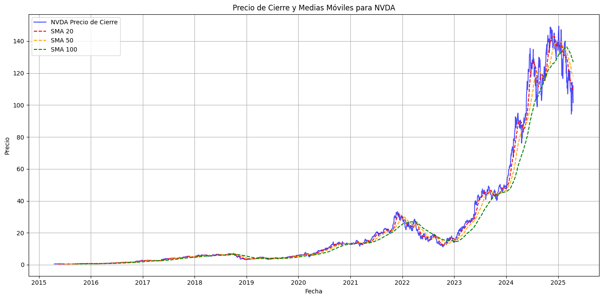
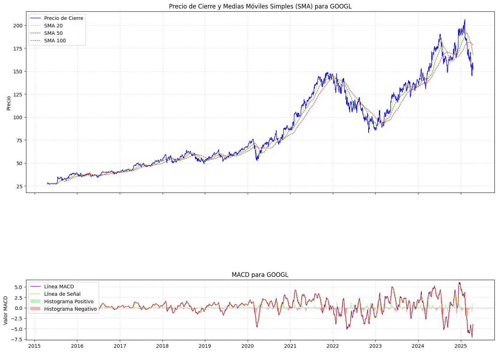
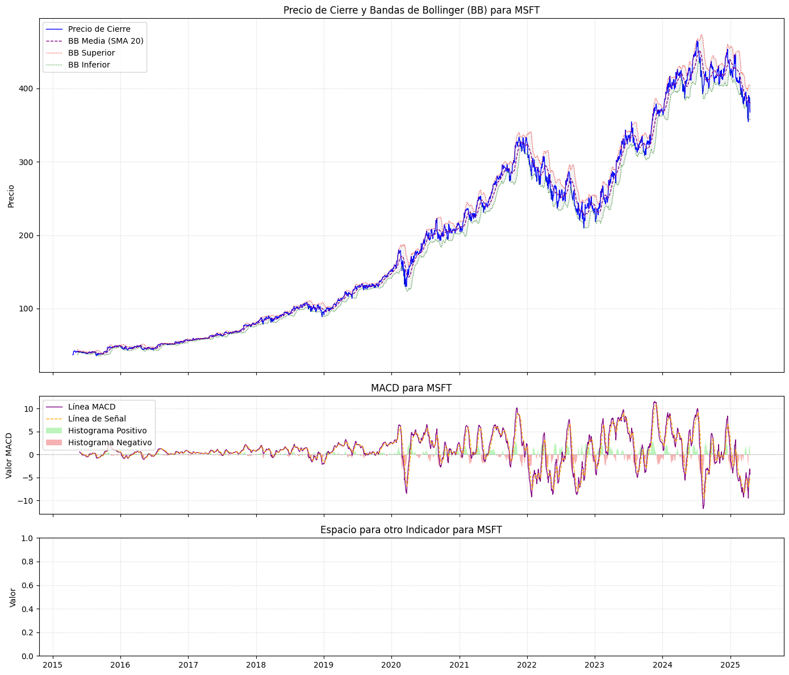

# financial-indicators-project

# Visualización de Indicadores Macroeconómicos para Acciones de Inteligencia Artificial

## Introducción 

Este pequeño proyecto es una exploración un poco mas profunda sobre el comportamiento de precios y volumen de acciones y ETFs clave en el sector de la Inteligencia Artificial (IA), para ello he implementado un análisis técnico avanzado un poco mas avanzado que mi proyecto anterior. El objetivo principal es aplicar y visualizar una serie de indicadores financieros para identificar tendencias, momentum y volatilidad, lo cual es fundamental para la toma de decisiones informadas desde una perspectiva histórica en un mercado volátil muy influenciado por la situación económica y política actual.

## Contexto y Motivación

El mercado de Inteligencia Artificial es uno muy dinámico, entender el "pulso" de los activos financieros es crucial para establecer patrones en caso de que se avecinen sucesos que puedan definir las dinámicas en tanto la compra y venta de acciones reacciona a estos. Mi motivación apela a la necesidad de aplicar herramientas analíticas robustas para ir más allá del precio diario y descubrir patrones subyacentes que puedan influir en el rendimiento futuro. Es un paso fundamental para cualquier análisis de inversión.

## Objetivos

* **Extracción y Limpieza de Datos:** Obtener datos históricos de precios y volumen para activos de IA y preparar un conjunto de datos limpio y estructurado.
* **Cálculo de Indicadores Técnicos:** Implementar y calcular indicadores clave como Medias Móviles Simples (SMA), MACD, Bandas de Bollinger (BB) y On-Balance Volume (OBV).
* **Visualización Interactiva:** Crear gráficos claros y concisos que permitan una rápida interpretación del comportamiento de los indicadores junto con el precio.
* **Fundamento para Hipótesis:** Establecer una base analítica sólida para futuras hipótesis y conclusiones sobre la dinámica de estos activos.

## Conjunto de Datos

Los datos históricos de precios y volumen se obtuvieron de **Yahoo Finance** utilizando la librería `yfinance` disponible para Python. El conjunto de datos incluye información diaria para varios tickers representativos del sector de IA.

## 🛠️ Metodología y Análisis

El proyecto sigue la siguiente estructura:

1.  **Extracción:** Uso de `yfinance` para descargar datos históricos de "Close", "High", "Low", "Open" y "Volume".
2.  **Pre - procesamiento:** Conversión de índices a formato de fecha, manejo de datos duplicados y valores faltantes para asegurar la calidad del dataset. Los datos limpios se guardan en formato `.parquet` para eficiencia.
3.  **Cálculo de Indicadores Técnicos:**
    * **Medias Móviles Simples (SMA):** Estas fueron calculadas para períodos de 20, 50 y 100 días para identificar tendencias a corto, medio y largo plazo.
    
    * **MACD (Moving Average Convergence Divergence):** Se usaron componentes (Línea MACD, Línea de Señal e Histograma) para medir el momentum y las posibles reversiones de tendencia.
    
    * **Bandas de Bollinger (BB):** Implementadas para evaluar la volatilidad del precio y posibles condiciones de sobrecompra/sobreventa.
    
   

4.  **Visualización:** Se generaron gráficos personalizados para cada activo, combinando el precio de cierre con las SMAs, MACD y Bandas de Bollinger, facilitando la interpretación visual de las dinámicas del mercado.

## Resultados Clave

Los gráficos generados muestran claramente cómo los diferentes indicadores técnicos interactúan con los movimientos de precios. Se observan periodos de alta y baja volatilidad, cambios en el momentum que preceden o confirman movimientos de precios, y cómo el volumen respalda (o no) las tendencias. Este análisis preliminar revela patrones distintivos para cada activo, preparando el terreno para un análisis más profundo y la formulación de estrategias de inversión.

## Tecnologías y Librerías

* **Python 3.x**
* **Pandas:** Para manipulación y análisis de datos.
* **yfinance:** Para la extracción de datos financieros.
* **ta:** Para el cálculo eficiente de indicadores técnicos.
* **Matplotlib:** Para la visualización de datos.
* **Jupyter Notebooks:** Para el desarrollo interactivo y la presentación del análisis.
* **pyarrow:** Para la gestión eficiente de archivos `.parquet`.

## Contacto

[Tu Nombre Completo]
[Tu Perfil de LinkedIn (ej: https://www.linkedin.com/in/tu-nombre/)]
[Tu Correo Electrónico (opcional)]